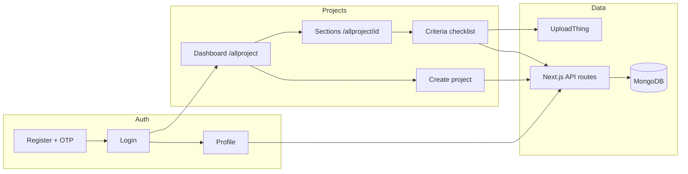

# Capstone — แอปตรวจสอบการเข้าถึงอาคาร

เว็บแอปสำหรับมือถือใช้ **ตรวจสอบการเข้าถึงอาคาร** ตามมาตรฐานภาครัฐ **มยผ. 6301** (มาตรฐานการออกแบบสิ่งอำนวยความสะดวกสำหรับผู้พิการและคนชรา) ผู้ตรวจให้คะแนนเกณฑ์ บันทึกหมายเหตุและรูปถ่าย ดูภาพอ้างอิงจากมาตรฐาน และติดตามความคืบหน้าต่อโครงการ ส่วนต่อประสานผสม **ภาษาอังกฤษและไทย**

**คู่มือเทคนิคสำหรับนักพัฒนาและ AI:** [`docs/AI_PROJECT_GUIDE.md`](docs/AI_PROJECT_GUIDE.md) (ภาษาอังกฤษ)

---

## โครงการนี้ทำอะไร

| ความสามารถ | คำอธิบาย |
|------------|----------|
| **บัญชีผู้ใช้** | สมัครสมาชิกด้วย OTP อีเมล เข้าสู่ระบบ โปรไฟล์ (ชื่อ ติดต่อ ที่ทำงาน) รูปโปรไฟล์ |
| **โครงการ** | สร้างโครงการตรวจ พร้อมสถานที่ ชื่อ คำอธิบาย และเลือกกลุ่มเกณฑ์ |
| **การตรวจ** | คะแนนต่อเกณฑ์ **0 / 1 / 2** หมายเหตุ รูปถ่ายหลายรูปต่อข้อ |
| **มาตรฐาน** | ข้อความจากแคตตาล็อก JSON ข้อความต้นฉบับ (`source_text`) พร้อมข้ออ้างอิงข้ามข้อ ภาพอ้างอิงจาก PDF มยผ. |
| **ทำงานร่วมกัน** | เจ้าของเปิดแชร์ ลิงก์เชิญ (`/join/[token]`) ผู้แก้ไขเข้าร่วมตรวจร่วมกัน ผู้แก้ไข **ออกจากรายการ** โครงการแชร์ได้โดยไม่ลบโครงการของเจ้าของ |
| **รายงาน** | เปอร์เซ็นต์ความสำเร็จ หน้ารายงาน / สรุปโครงการ |

---

## ขั้นตอนการทำงานของระบบ (ภาพรวม)



### เส้นทางผู้ตรวจทั่วไป

1. **สมัครสมาชิก** → ยืนยัน OTP อีเมล → **กรอกโปรไฟล์ให้ครบ** (จำเป็นก่อนสร้างโครงการ)
2. **เข้าสู่ระบบ** → ไปที่ **โครงการทั้งหมด** (`/allproject`)
3. **สร้างโครงการ** → กรอกสถานที่และชื่อ → **เลือกกลุ่มเกณฑ์** (หมวดจาก มยผ.) → `POST /api/project` สร้าง `sections[]` ใน MongoDB
4. เปิดโครงการ → **เลือกหมวด** → เปิด **กลุ่มเกณฑ์** → ให้คะแนนแต่ละข้อ บันทึกหมายเหตุ/รูป ขยาย **ข้อความต้นฉบับ** (จัดเป็นหัวข้อและ bullet + ภาพอ้างอิง)
5. **เจ้าของ:** แชร์โครงการ (เปิด collaboration คัดลอกลิงก์เชิญ) **ผู้แก้ไข:** เปิดลิงก์ขณะล็อกอิน → `POST /api/join/[token]` → โครงการแสดงเป็น “Shared with you” **เอาออกจากรายการ** ได้โดยไม่ลบโครงการของเจ้าของ
6. **ความสำเร็จ** อัปเดตผ่าน Mongoose pre-save เมื่อมีการให้คะแนน เจ้าของปิดโครงการได้เมื่อให้คะแนนครบทุกเกณฑ์

### การไหลของข้อมูล (บันทึกเกณฑ์หนึ่งข้อ)

```
InspectionItemRow (ฝั่ง client)
  → PATCH /api/project/[id]/critiria/[criteriaId]
  → auth() + สิทธิ์โครงการ (เจ้าของ | ผู้แก้ไข)
  → optimistic concurrency (updatedAt / 409 เมื่อชนกัน)
  → MongoDB เกณฑ์ฝังใน project.sections[].criteria[]
```

---

## เทคโนโลยีที่ใช้

| ชั้น | เทคโนโลยี |
|------|-----------|
| Framework | Next.js 16 (App Router) |
| UI | React 19, CSS Modules |
| Auth | NextAuth v5 (Credentials, JWT) |
| ฐานข้อมูล | MongoDB + Mongoose |
| อัปโหลด | UploadThing (`profileImg`, `inspectionImg`, `projectCoverImg`) |
| มาตรฐาน | JSON ใน `lib/standards/` + `catalog.ts` |

---

## แผนที่โฟลเดอร์ — บทบาทของแต่ละส่วน

```
Capstone-Project/
├── app/                    # หน้า UI และ API routes (Next.js App Router)
├── auth.ts, auth.config.ts # NextAuth และการตั้งค่า session/JWT
├── middleware.ts           # redirect เมื่อไม่ล็อกอิน; API คืน 401
├── lib/                    # logic ฝั่งเซิร์ฟเวอร์ โมเดล แคตตาล็อกมาตรฐาน
├── public/                 # ไฟล์คงที่ (ภาพมาตรฐาน favicon)
├── scripts/                # ดูแล PDF enrichment ทดสอบ validate
├── tests/                  # ทดสอบด้วย tsx --test
├── docs/                   # คู่มือ AI แผนภาพ field-test รายงาน
└── standards-source/       # สำเนา PDF ต้นฉบับ (ไม่ serve ตอนรันแอป)
```

### `app/` — หน้าและฟีเจอร์

| Path | ฟีเจอร์ / หน้าที่ |
|------|-------------------|
| `app/page.tsx` | หน้าแรก → ไปแดชบอร์ดโครงการ |
| `app/login/`, `app/register/`, `app/verify/` | เข้าสู่ระบบ สมัคร OTP |
| `app/forgot-password/` | รีเซ็ตรหัสผ่าน |
| `app/profile/` | แก้โปรไฟล์ **ต้องครบ** ก่อน `POST /api/project` |
| `app/allproject/page.tsx` | **แดชบอร์ด** — รายการ/ค้นหาโครงการ สร้างโครงการ |
| `app/allproject/[projectId]/page.tsx` | **ศูนย์โครงการ** — นำทางหมวดและกลุ่ม |
| `app/allproject/[projectId]/criteria/[criteriaGroupId]/page.tsx` | **หน้าตรวจ** — checklist กลุ่มหนึ่ง |
| `app/allproject/[projectId]/report/page.tsx` | รายงาน / สรุปโครงการ |
| `app/join/[token]/page.tsx` | รับคำเชิญทำงานร่วมกัน |
| `app/allproject/_components/` | UI ร่วม: การ์ด modal `InspectionItemRow` `SectionPicker` sidebar |
| `app/api/auth/` | สมัคร OTP NextAuth (`runtime = "nodejs"`) |
| `app/api/project/` | CRUD โครงการ PATCH **critiria** add-groups collaboration **leave** |
| `app/api/join/[token]/` | เข้าร่วมเป็น editor |
| `app/api/users/[id]/` | โปรไฟล์ GET/PATCH |
| `app/api/uploadthing/` | อัปโหลดไฟล์ (ตรวจ session ต่อ slug) |
| `app/_components/` | `ThemeProvider`, `AppLogo` |
| `app/_globle_components/Form/` | ฟอร์มโปรไฟล์ใช้ซ้ำ |

### `lib/` — logic สำคัญ (ควรใส่ใจ)

| Path | ทำอะไร | ทำไมสำคัญ |
|------|--------|-----------|
| `lib/model/project.ts` | schema โครงการ sections เกณฑ์ completion | เปลี่ยนโครงสร้างกระทบ API และ UI ทั้งหมด |
| `lib/model/user.ts` | ผู้ใช้และ contact | อีเมลล็อกอิน ความครบโปรไฟล์ |
| `lib/standards/catalog.ts` | โหลด JSON → `STANDARDS_CATALOG` | แหล่งข้อความ checklist |
| `lib/standards/*.json` | ข้อมูล มยผ. (`display_text`, `source_text`) | แก้เนื้อหามาตรฐานที่นี่ |
| `lib/standards/format-source-text.ts` | แปลง `source_text` เป็น bullet บน UI | แสดงผลเท่านั้น JSON ยังเป็นข้อความเต็ม |
| `lib/standards/figure-map.json` | ข้อ → ไฟล์ภาพ | ภาพอ้างอิงบนแถวเกณฑ์ |
| `lib/project-sections.ts` | สร้าง `sections[]` ตอนสร้าง/เพิ่มกลุ่ม | ต้องตรง group ID ในแคตตาล็อก |
| `lib/project-access.ts` | `canEditProject`, `canLeaveProject` แชร์ | สิทธิ์ PATCH / leave / share |
| `lib/project-patch.ts` | ตรวจ body PATCH metadata | กันการแทนที่ `sections` ทั้งก้อน |
| `lib/criterion-concurrency.ts` | ตรวจ `updatedAt` ชนกัน | ผู้ตรวจหลายคน → 409 |
| `lib/profile-complete.ts` | ฟิลด์บังคับก่อนสร้างโครงการ | กั้น modal สร้างโครงการ |
| `lib/db.ts` | เชื่อม Mongo | ต้องมี `MONGO_URI` |

### `scripts/` — เครื่องมือออฟไลน์

| Script | ใช้ทำอะไร |
|--------|-----------|
| `enrich-cross-ref-sources.ts` | เติมข้อความข้ออ้างอิงใน `source_text` |
| `extract-pdf-figures.py` | ดึง PNG จาก PDF มยผ. |
| `validate-premerge.ts` | ตรวจแคตตาล็อก/API ก่อน merge (`npm run validate`) |
| `field-test-preflight.ts`, `field-test-smoke.ts` | ทดสอบสภาพแวดล้อมและ smoke |

### `docs/` — เอกสาร

| Path | เนื้อหา |
|------|---------|
| `docs/AI_PROJECT_GUIDE.md` | **คู่มือหลักสำหรับ dev** — API ข้อควรระวัง |
| `docs/reports/` | ER diagram user flow รายงานโครงงาน |
| `docs/field-testing/` | runbook สเปรดชีต ผลทดสอบ |

---

## แก้ฟีเจอร์ใด — ไปที่ไฟล์ไหน

| ฟีเจอร์ | ไฟล์หลัก |
|---------|----------|
| รายการโครงการและค้นหา | `app/allproject/page.tsx`, `project-utils.ts` |
| สร้างโครงการและเลือกเกณฑ์ทั้งหมด | `CreateProjectModal.tsx`, `SectionPicker.tsx`, `app/api/project/route.ts` |
| การ์ดโครงการ (ปก เมนู แบดจ์แชร์ ออกจากรายการ) | `ProjectCard.tsx`, `LeaveConfirmDialog.tsx`, `leave/route.ts` |
| แชร์ / เชิญ | `ShareProjectDialog.tsx`, `collaboration/route.ts`, `invite/route.ts`, `join/` |
| นำทางหมวด | `[projectId]/page.tsx`, `SectionPicker.tsx` (โหมด navigate) |
| ให้คะแนนและรูปถ่าย | `InspectionItemRow.tsx`, `critiria/[critiriaId]/route.ts` |
| แสดงข้อความต้นฉบับ (bullet + อ้างอิง) | `SourceTextDisplay.tsx`, `format-source-text.ts`, JSON ที่ enrich แล้ว |
| เพิ่มเกณฑ์ในโครงการเดิม | `AddCriteriaModal.tsx`, `add-groups/route.ts` |
| โปรไฟล์และกั้นสร้างโครงการ | `profile/`, `profile-complete.ts`, `users/[id]/route.ts` |
| Auth / login | `auth.ts`, `auth.config.ts`, `app/login/page.tsx` |
| ธีม / โลโก้ | `ThemeProvider.tsx`, `AppLogo.tsx`, `app/layout.tsx` |
| เนื้อหามาตรฐาน | `lib/standards/*.json`, รัน `enrich-cross-ref-sources.ts` หลังแก้ข้ออ้างอิง |

---

## จุดสำคัญที่ควรใส่ใจ

1. **สะกด API `critiria`** — ใน URL ตั้งใจไว้ เปลี่ยนจะพัง client
2. **แคตตาล็อก vs MongoDB** — JSON กำหนดว่าตรวจอะไรได้ เอกสารโครงการเก็บ**คะแนน** ต่อ `criteriaId` ห้าม PATCH `sections` ทั้งก้อนจาก client
3. **ภาพอ้างอิง `img` vs รูปตรวจ `imgs`** — `item.img` คือแผนภาพ มยผ. `criterion.imgs` คือรูปที่ผู้ใช้อัปโหลด
4. **ชนกันหลายคน** — แก้เกณฑ์เดียวกันพร้อมกัน → **409** ควร refresh แบ่งงานตามหมวด/กลุ่ม
5. **Auth** — `fetch` ต้อง `credentials: "include"` ตั้ง `AUTH_SECRET` และ `AUTH_URL` (ลิงก์เชิญ / ngrok)
6. **กั้นโปรไฟล์** — โปรไฟล์ไม่ครบสร้างโครงการไม่ได้ (403 + `missingFields`)
7. **ไฟล์ `อย่ายุ่งกับอันนี้.json`** — ชุดมาตรฐานสิ่งอำนวยความสะดวก ชื่อไฟล์ตั้งใจ
8. **dev server เดียว** — รัน `next dev` แค่พอร์ต 3000 เดียว กัน session สับสน

---

## เริ่มต้นใช้งาน

### สิ่งที่ต้องมี

- Node.js 20+
- MongoDB
- บัญชี UploadThing
- (ทางเลือก) Gmail App Password สำหรับ OTP

### ติดตั้ง

```bash
cp .env.example .env
# กรอก MONGO_URI, AUTH_SECRET, UPLOADTHING_TOKEN, EMAIL_* สำหรับ OTP

npm install
npm run dev
```

เปิด [http://localhost:3000](http://localhost:3000) ลำดับปกติ: สมัคร → ยืนยัน → โปรไฟล์ → `/allproject`

### คำสั่งตรวจคุณภาพ

```bash
npm test              # ทดสอบหน่วย (access, profile, concurrency, format-source-text, …)
npm run validate      # ตรวจแคตตาล็อก/API ก่อน merge
npm run build         # build production
npm run field-test:smoke   # smoke HTTP (ต้องรัน dev server ก่อน)
```

---

## ตัวแปรสภาพแวดล้อม

| ตัวแปร | จำเป็น | ใช้ทำอะไร |
|--------|--------|-----------|
| `MONGO_URI` | ใช่ | MongoDB |
| `AUTH_SECRET` | ใช่ | NextAuth / JWT |
| `UPLOADTHING_TOKEN` | ใช่ | อัปโหลด |
| `AUTH_URL` | แนะนำ | URL ฐานสำหรับลิงก์เชิญ (ตั้งเป็น ngrok เมื่อทดบนมือถือ) |
| `EMAIL_USER` / `EMAIL_PASS` | สำหรับ OTP | อีเมลยืนยันตอนสมัคร |

ดู [`.env.example`](.env.example)

---

## เอกสารที่เกี่ยวข้อง

- [`docs/AI_PROJECT_GUIDE.md`](docs/AI_PROJECT_GUIDE.md) — สถาปัตยกรรม API ข้อควรระวัง (EN)
- [`docs/reports/user-flow-diagram.md`](docs/reports/user-flow-diagram.md) — แผนภาพ user flow
- [`docs/reports/er-diagram-user-project.md`](docs/reports/er-diagram-user-project.md) — โมเดล User / Project
- [`docs/field-testing/README.md`](docs/field-testing/README.md) — โปรโตคอลทดสอบภาคสนาม

---

## บริบทโครงงาน

โครงงาน Capstone — เครื่องมือตรวจการเข้าถึงตาม **มยผ. 6301** ข้อความและภาพมาจาก PDF มาตรฐานอย่างเป็นทางการ logic และ UI เป็นของโครงการนี้
