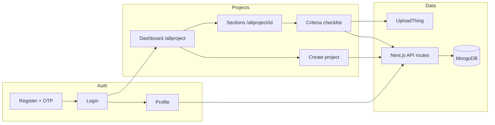

# Capstone — Accessibility Inspection App

Mobile-first web application for **building accessibility inspections** against the Thai public-sector standard **มยผ. 6301** (มาตรฐานการออกแบบสิ่งอำนวยความสะดวกสำหรับผู้พิการและคนชรา). Inspectors score criteria, attach notes and photos, view reference diagrams from the standard, and track completion per project. The UI mixes **English and Thai**.

**Deep technical reference for developers and AI agents:** [`docs/AI_PROJECT_GUIDE.md`](docs/AI_PROJECT_GUIDE.md)

---

## What this project does

| Capability | Description |
|------------|-------------|
| **Accounts** | Register with email OTP, login, profile (name, contact, workplace), profile photo |
| **Projects** | Create inspection projects with location, name, description, and selected criteria groups |
| **Inspection** | Per-criterion score **0 / 1 / 2**, notes, multiple inspection photos |
| **Standards** | Checklist text from JSON catalog; **original clause text** (`source_text`) with cross-reference enrichment; reference **figures** from มยผ. PDF |
| **Collaboration** | Owner enables sharing, invite link (`/join/[token]`); editors join and co-inspect; editors can **leave** shared projects from the dashboard |
| **Reporting** | Project completion %, report view, optional ML assessment hook |

---

## System workflow (end-to-end)



### Typical inspector journey

1. **Register** → verify email OTP → **complete profile** (required before creating a project).
2. **Login** → land on **All projects** (`/allproject`).
3. **Create project** → enter location & name → **select criteria groups** (sections from มยผ.) → `POST /api/project` builds `sections[]` in MongoDB.
4. Open project → **section picker** → open a **criteria group** → score each item, add notes/photos, expand **ข้อความต้นฉบับ** (formatted source text + reference image).
5. **Owner:** share project (enable collaboration, copy invite link). **Editor:** open link while logged in → `POST /api/join/[token]` → project appears as “Shared with you”; can **remove from list** without deleting the project for the owner.
6. **Completion** updates via Mongoose pre-save hooks when scores change; owner can mark project done when all criteria are scored.

### Data flow (one criterion save)

```
InspectionItemRow (client)
  → PATCH /api/project/[id]/critiria/[criteriaId]
  → auth() + project access (owner | editor)
  → optimistic concurrency (updatedAt / 409 on conflict)
  → MongoDB criterion embedded in project.sections[].criteria[]
```

---

## Tech stack

| Layer | Technology |
|--------|------------|
| Framework | Next.js 16 (App Router) |
| UI | React 19, CSS Modules |
| Auth | NextAuth v5 (Credentials, JWT) |
| Database | MongoDB + Mongoose |
| Uploads | UploadThing (`profileImg`, `inspectionImg`, `projectCoverImg`) |
| Standards | Static JSON in `lib/standards/` + `catalog.ts` |

---

## Repository map — folders and roles

```
Capstone-Project/
├── app/                    # All UI pages and API routes (Next.js App Router)
├── auth.ts, auth.config.ts # NextAuth providers and session/JWT config
├── middleware.ts           # Auth redirect for pages; 401 for protected API
├── lib/                    # Shared server logic, models, standards catalog
├── public/                 # Static assets (standard figures, favicon)
├── scripts/                # Maintenance: PDF figures, enrichment, field-test, validate
├── tests/                  # Node test runner (tsx --test)
├── docs/                   # AI guide, diagrams, field-testing runbooks, reports
└── standards-source/       # Source PDF copy for figure extraction (not served at runtime)
```

### `app/` — pages and features

| Path | Feature / responsibility |
|------|---------------------------|
| `app/page.tsx` | Home → redirects into project dashboard |
| `app/login/`, `app/register/`, `app/verify/` | Authentication and email OTP |
| `app/forgot-password/` | Password reset flow |
| `app/profile/` | Edit profile; **must be complete** before `POST /api/project` |
| `app/allproject/page.tsx` | **Dashboard** — list/search owned + shared projects, create modal |
| `app/allproject/[projectId]/page.tsx` | **Project hub** — sections & groups navigation |
| `app/allproject/[projectId]/criteria/[criteriaGroupId]/page.tsx` | **Inspection UI** — checklist for one group |
| `app/allproject/[projectId]/report/page.tsx` | Project report / summary view |
| `app/join/[token]/page.tsx` | Accept collaboration invite |
| `app/allproject/_components/` | Shared UI: cards, modals, `InspectionItemRow`, `SectionPicker`, sidebar |
| `app/api/auth/` | Register, OTP, NextAuth handler (`runtime = "nodejs"`) |
| `app/api/project/` | CRUD projects, sections, **critiria** PATCH, add-groups, collaboration, **leave** |
| `app/api/join/[token]/` | Join project as editor |
| `app/api/users/[id]/` | Profile GET/PATCH |
| `app/api/uploadthing/` | File upload routes (session checked per slug) |
| `app/_components/` | `ThemeProvider`, `AppLogo` |
| `app/_globle_components/Form/` | Reusable profile form fields |

### `lib/` — business logic (care about these)

| Path | What it does | Why it matters |
|------|----------------|----------------|
| `lib/model/project.ts` | Project schema, sections, criteria, completion hooks | Changing shape affects API + all inspection UIs |
| `lib/model/user.ts` | User + contact | Login email, profile completeness |
| `lib/standards/catalog.ts` | Loads JSON → `STANDARDS_CATALOG`, lookups, group IDs | Single source for checklist content |
| `lib/standards/*.json` | Raw มยผ. criteria (`display_text`, `source_text`, clauses) | Editorial changes happen here |
| `lib/standards/format-source-text.ts` | Parses enriched `source_text` for bullet UI | Display-only; JSON stays full legal text |
| `lib/standards/figure-map.json` | Clause → figure file mapping | Reference images on criteria rows |
| `lib/project-sections.ts` | Builds `sections[]` when creating/adding groups | Must stay in sync with catalog group IDs |
| `lib/project-access.ts` | `canEditProject`, `canLeaveProject`, share rules | Authorization for PATCH / leave / share |
| `lib/project-patch.ts` | Validates metadata PATCH body | Prevents replacing `sections` via PATCH |
| `lib/criterion-concurrency.ts` | `updatedAt` conflict detection | Multi-inspector 409 handling |
| `lib/profile-complete.ts` | Required fields before create project | Gates create modal |
| `lib/db.ts` | Mongo connection | Requires `MONGO_URI` |

### `scripts/` — offline tooling

| Script | Purpose |
|--------|---------|
| `enrich-cross-ref-sources.ts` | Appends referenced clause text to `source_text` for cross-ref items |
| `extract-pdf-figures.py` | Extract diagram PNGs from มยผ. PDF |
| `validate-premerge.ts` | Pre-merge catalog/API checks (`npm run validate`) |
| `field-test-preflight.ts`, `field-test-smoke.ts` | Field-test environment and smoke paths |

### `docs/` — documentation

| Path | Contents |
|------|----------|
| `docs/AI_PROJECT_GUIDE.md` | **Primary dev guide** — APIs, quirks, conventions |
| `docs/reports/` | ER diagram, user flow, capstone report (Thai) |
| `docs/field-testing/` | Runbooks, spreadsheets, session results |

---

## Feature designation (what to touch for each task)

| Feature | Primary files |
|---------|----------------|
| Project list & search | `app/allproject/page.tsx`, `project-utils.ts` |
| Create project & select all criteria | `CreateProjectModal.tsx`, `SectionPicker.tsx`, `POST app/api/project/route.ts` |
| Project card (cover, kebab, shared badge, leave) | `ProjectCard.tsx`, `project-card.module.css`, `LeaveConfirmDialog.tsx`, `leave/route.ts` |
| Share / invite | `ShareProjectDialog.tsx`, `collaboration/route.ts`, `invite/route.ts`, `join/` |
| Section navigation | `[projectId]/page.tsx`, `SectionPicker.tsx` (navigate mode) |
| Criterion scoring & photos | `InspectionItemRow.tsx`, `critiria/[critiriaId]/route.ts` |
| Source text display (bullets + cross-refs) | `SourceTextDisplay.tsx`, `format-source-text.ts`, enriched JSON |
| Add criteria to existing project | `AddCriteriaModal.tsx`, `add-groups/route.ts` |
| Profile & create gate | `profile/`, `profile-complete.ts`, `users/[id]/route.ts` |
| Auth / login errors | `auth.ts`, `auth.config.ts`, `app/login/page.tsx` |
| Theme / branding | `ThemeProvider.tsx`, `lib/theme.ts`, `AppLogo.tsx`, `app/layout.tsx` |
| Standards content | `lib/standards/*.json`, run `enrich-cross-ref-sources.ts` after cross-ref edits |

---

## Important areas to care about

1. **API spelling `critiria`** — URL segment is intentional; renaming breaks clients.
2. **Catalog vs MongoDB** — JSON defines *what* can be inspected; project documents store *scores* per `criteriaId`. Do not PATCH whole `sections` from the client.
3. **Reference `img` vs inspection `imgs`** — `item.img` is มยผ. diagram; `criterion.imgs` are user uploads.
4. **Concurrency** — Two inspectors editing the same criterion → **409**; UI should refresh. Prefer splitting work by section/group.
5. **Auth** — Client `fetch` must use `credentials: "include"`; `AUTH_SECRET` and `AUTH_URL` (for invite links / ngrok) must be set in production.
6. **Profile gate** — Incomplete profile blocks project creation (403 + `missingFields`).
7. **File `อย่ายุ่งกับอันนี้.json`** — Facilities standard bundle; filename is intentional.
8. **One dev server** — Only one `next dev` on port 3000 to avoid session confusion.

---

## Getting started

### Prerequisites

- Node.js 20+
- MongoDB instance
- UploadThing account
- (Optional) Gmail app password for OTP email

### Setup

```bash
cp .env.example .env
# Fill MONGO_URI, AUTH_SECRET, UPLOADTHING_TOKEN, EMAIL_* for OTP

npm install
npm run dev
```

Open [http://localhost:3000](http://localhost:3000). Default flow: register → verify → profile → `/allproject`.

### Quality commands

```bash
npm test              # Unit tests (access, profile, concurrency, format-source-text, …)
npm run validate      # Catalog / API pre-merge checks
npm run build         # Production build
npm run field-test:smoke   # HTTP smoke paths (dev server must be running)
```

---

## Environment variables

| Variable | Required | Purpose |
|----------|----------|---------|
| `MONGO_URI` | Yes | MongoDB |
| `AUTH_SECRET` | Yes | NextAuth / JWT |
| `UPLOADTHING_TOKEN` | Yes | Uploads |
| `AUTH_URL` | Recommended | Base URL for invite links (set to ngrok URL when testing on phone) |
| `EMAIL_USER` / `EMAIL_PASS` | For OTP | Registration verification email |

See [`.env.example`](.env.example).

---

## Related documentation

- [`docs/AI_PROJECT_GUIDE.md`](docs/AI_PROJECT_GUIDE.md) — architecture, API table, auth pitfalls, figure pipeline
- [`docs/reports/user-flow-diagram.md`](docs/reports/user-flow-diagram.md) — user journey diagram
- [`docs/reports/er-diagram-user-project.md`](docs/reports/er-diagram-user-project.md) — User / Project data model
- [`docs/field-testing/README.md`](docs/field-testing/README.md) — field test protocol

---

## License / academic context

Capstone project — accessibility inspection tooling aligned with **มยผ. 6301**. Standards text and figures derive from the official standard PDF; app logic and UI are project-owned.
