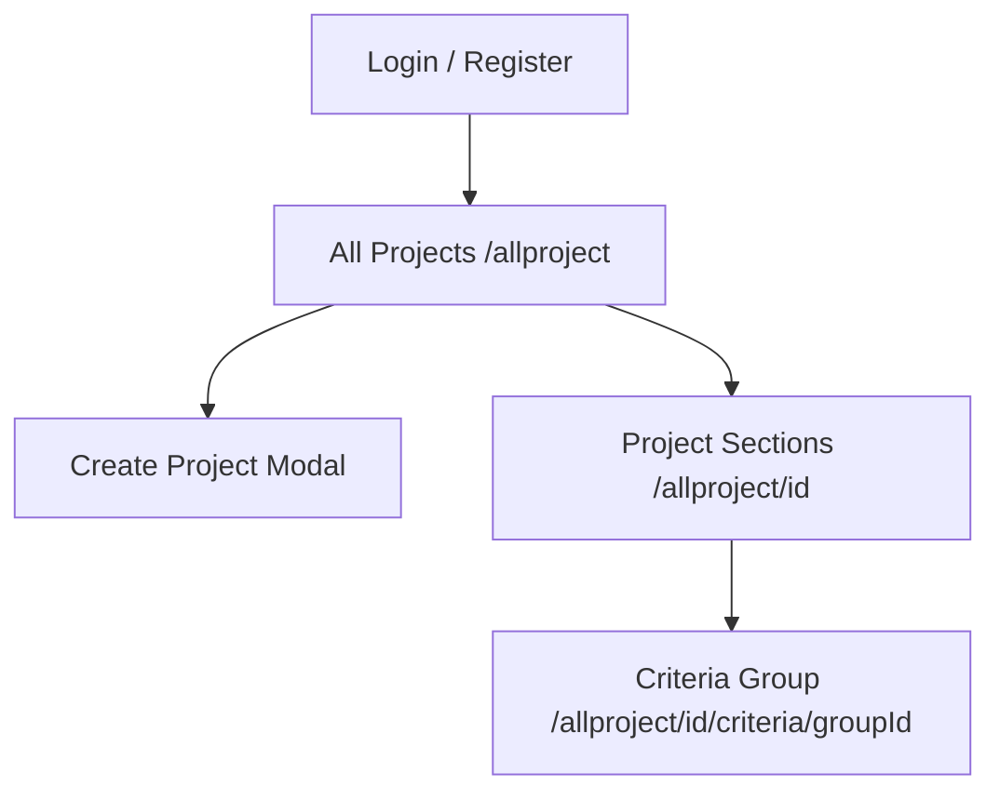

# AI Project Guide — Capstone Accessibility Inspection App

**Read this file before changing code in this repository.** It is the source of truth for humans and AI agents working on this capstone project.

Also read [`AGENTS.md`](../AGENTS.md) for Next.js 16-specific rules (this is not the Next.js version from older training data).

---

## 1. Purpose

Mobile-first web app for **building accessibility inspections** against the Thai public-sector standard **มยผ. 6301** (inclusive design for people with disabilities and older adults).

Inspectors can:

- Register / log in
- Create **projects** (sites/buildings) with selected criteria groups
- Score each criterion (0 / 1 / 2), add notes, upload inspection photos
- View **reference figures** from the standard (diagrams extracted from the official PDF)
- Track completion % per project

**Language:** UI mix of English and Thai. Standards content and many labels are Thai.

---

## 2. Tech stack

| Layer | Technology |
|--------|------------|
| Framework | **Next.js 16** (App Router, Turbopack dev) |
| UI | **React 19**, CSS Modules |
| Auth | **NextAuth v5** (Auth.js) — Credentials provider, **JWT** sessions |
| Database | **MongoDB** via **Mongoose 9** |
| File uploads | **UploadThing** (`profileImg`, `inspectionImg`, `projectCoverImg`) |
| Password hashing | **bcryptjs** |
| Standards data | Static **JSON** in `lib/standards/` + runtime catalog in `lib/standards/catalog.ts` |
| Reference images | PNGs in `public/standards/figures/` + metadata in `lib/standards/figure-map.json` |
| PDF tooling | Python + PyMuPDF (`scripts/extract-pdf-figures.py`) — not required at runtime |

**Important:** Check `node_modules/next/dist/docs/` before using Next.js APIs; conventions differ from Next.js 14 in training data.

---

## 3. Environment variables

Required in `.env` (never commit secrets):

```env
MONGO_URI=          # MongoDB connection string
AUTH_SECRET=        # Auth.js / NextAuth secret
UPLOADTHING_TOKEN=  # UploadThing API token
```

Optional for production: `AUTH_URL` (e.g. `http://localhost:3000`).

`lib/db.ts` throws at **connect time** if `MONGO_URI` is missing (not at import).

---

## 4. Repository structure

```
Capstone-Project/
├── app/                          # Next.js App Router
│   ├── page.tsx                  # Home → renders AllProjectPage
│   ├── layout.tsx                # Root layout + SessionProvider
│   ├── provider.tsx              # next-auth SessionProvider
│   ├── login/                    # Login UI (client signIn)
│   ├── register/                 # Registration
│   ├── profile/                  # User profile + avatar upload
│   ├── allproject/               # Main inspection UX
│   │   ├── page.tsx              # Project dashboard + search
│   │   ├── [projectId]/          # Section picker for one project
│   │   │   └── criteria/[criteriaGroupId]/  # Criteria checklist
│   │   └── _components/          # PhoneShell, cards, inspection rows, etc.
│   └── api/
│       ├── auth/[...nextauth]/   # Auth.js handlers
│       ├── auth/register/        # POST create user
│       ├── project/              # GET list, POST create
│       ├── project/[projectId]/  # GET/PATCH/DELETE project
│       ├── project/[projectId]/collaboration/  # POST enable sharing (owner)
│       ├── project/[projectId]/invite/         # GET invite URL (owner)
│       ├── join/[token]/         # POST accept invite (authenticated)
│       ├── join/[token]/page.tsx # Client join flow + login redirect
│       ├── project/.../critiria/ # PATCH single criterion (typo in URL — do not rename casually)
│       ├── project/.../section/  # Section APIs
│       ├── uploadthing/          # Upload routes
│       └── users/[id]/           # User profile API
├── auth.ts                       # NextAuth config + Credentials authorize
├── auth.config.ts                # Session JWT, trustHost, signIn page
├── middleware.ts                 # Currently passthrough; auth guard commented out
├── lib/
│   ├── db.ts                     # Mongoose connection singleton
│   ├── model/                    # User, Project schemas
│   ├── project-sections.ts       # Build sections from selected group IDs
│   └── standards/                # JSON standards + catalog.ts + figure-map.json
├── public/standards/figures/     # figure_01.png … figure_71.png
├── standards-source/             # Source PDF copy (maypho6301.pdf)
├── scripts/                      # PDF extract / caption fix (Python)
├── types/next-auth.d.ts          # Session user.id extension
└── docs/                         # This guide
```

---

## 5. Core domain model

### User (`lib/model/user.ts`)

- `firstName`, `lastName`, `password` (select: false)
- `contact.email` (unique, lowercase) — used for login
- `profileImg` (UploadThing URL)
- Optional `organization`, `projects[]` refs

### Project (`lib/model/project.ts`)

- `userId` — **owner (creator)**; never transferred
- `collaborationEnabled` — owner must enable before invite links work
- `members[]` — `{ userId, role: 'editor', joinedAt }` for teammates who joined via invite
- `projectName`, `description`, `institution.address` (location from create form)
- `coverImg` — optional card thumbnail (UploadThing); **owner-only** PATCH
- `sections[]` — each has `code`, `selectedGroups`, `criteria[]`
- Each **criterion**: `criteriaId`, `score` (0|1|2|null), `note`, `imgs[]` (and legacy `img`)
- Pre-save hook recalculates section/project totals and `completionRate`

### Standards catalog (`lib/standards/catalog.ts`)

- Loads 8 main JSON files → `STANDARDS_CATALOG`
- Items have `item_id` (e.g. `3.1.1.2-a`), `display_text`, `source_text`, `notes`, optional `img`
- Reference images resolved from:
  1. `reference_images` / `figure_N` in JSON
  2. `source_clause` → `lib/standards/figure-map.json`
- `findCatalogItem`, `findCatalogGroup`, `findCatalogSection` for lookups

**Do not** confuse catalog reference `img` with user inspection photos (`criterion.imgs`).

---

## 6. Main user flows



1. **Dashboard** (`app/allproject/page.tsx`): loads `GET /api/project` (owned + shared), client-side **search** by name + address (`filterProjects` in `project-utils.ts`).
2. **Create project**: picks criteria **groups** → `POST /api/project` → `buildProjectSectionsFromSelection`.
3. **Share / join**: owner enables collaboration on card kebab → copies `/join/[token]` link; teammate logs in → `POST /api/join/[token]` → lands on project.
4. **Section page**: lists sections/groups for navigation.
5. **Criteria page**: `InspectionItemRow` — score, notes, inspection photos, reference image (ภาพอ้างอิง) + lightbox.

**Multi-user editing:** last-write-wins on PATCH (no real-time sync). Two editors on the same criterion may overwrite each other.

---

## 7. API conventions (critical)

| Endpoint | Notes |
|----------|--------|
| `GET /api/project` | Returns only `session.user.id` projects |
| `PATCH /api/project/[id]` | Supports `coverImg`, `sections`; use `toObject()` in responses |
| `PATCH .../critiria/[critiriaId]` | **Spelled critiria** in path — changing breaks clients |
| Criterion PATCH | Body: `score`, `note`, `img`, `imgs`; uses `markModified("sections")` on save |

Always use `credentials: "include"` on client `fetch` for authenticated routes.

Auth route: `app/api/auth/[...nextauth]/route.ts` must use `export const runtime = "nodejs"` (Mongoose).

---

## 8. UI patterns

- **PhoneShell** — fixed max-width ~420px, teal gradient; simulates mobile app.
- **Client components** for auth, uploads, inspection (use `"use client"`).
- **Project cards**: white card; kebab (share, cover upload, delete) **owner only**; collaborators see “Shared with you” badge, no kebab. Share opens modal → enable collaboration → copy invite link.
- **InspectionItemRow**: expandable row; reference image separate from user `inspectionImgs` gallery.

Avoid large unrelated refactors; match existing CSS module naming in `_components/*.module.css`.

---

## 9. UploadThing endpoints (`app/api/uploadthing/route.ts`)

| Endpoint | Use |
|----------|-----|
| `profileImg` | Profile avatar (note: may have hardcoded test userId in server handler — verify before production) |
| `inspectionImg` | Criteria inspection photos (auth required) |
| `projectCoverImg` | Project card cover (auth required) |

Client helpers: `app/allproject/_components/inspection-upload.ts` (`useUploadThing`).

Prefer `ufsUrl ?? url ?? appUrl` from upload responses.

---

## 10. Auth pitfalls (avoid regressions)

- Login uses **client** `signIn("credentials", { redirect: false, callbackUrl })` — not only server actions.
- `authorize()` must **try/catch** and return `null` on failure — uncaught errors return HTML and cause `Unexpected token '<'` JSON errors.
- `AUTH_SECRET` and `trustHost: true` in `auth.config.ts`.
- `useRequireAuth` redirects unauthenticated users to `/login?callbackUrl=...`.
- Global route protection in `middleware.ts` is **disabled** (commented); pages rely on `useRequireAuth`.

---

## 11. Reference figures (มยผ. 6301 PDF)

- Source PDF: `standards-source/maypho6301.pdf` (copy of user’s มยผ.6301.pdf).
- Regenerate images: `python scripts/extract-pdf-figures.py`
- Fix Thai caption spacing: `python scripts/fix-figure-captions.py`
- Outputs: `public/standards/figures/figure_XX.png`, `lib/standards/figure-map.json`

Captions show in UI as `item.imgCaption` under reference image (diagram-only crop).

---

## 12. Git / workflow notes

- User often works on feature branches (`projectCard`, `search`, etc.).
- **Do not commit or push** unless the user explicitly asks.
- **Do not amend** commits unless user rules allow it.
- Prefer minimal, focused diffs.

---

## 13. Common tasks — where to edit

| Task | Primary files |
|------|----------------|
| Project list / search | `app/allproject/page.tsx`, `project-utils.ts` |
| Project card UI | `ProjectCard.tsx`, `ProjectCardThumb.tsx` |
| Criterion scoring UI | `InspectionItemRow.tsx`, criteria `page.tsx` |
| Standards text / groups | `lib/standards/*.json`, `catalog.ts` |
| New API field on project | `lib/model/project.ts`, `app/api/project/...` |
| Auth/login bugs | `auth.ts`, `auth.config.ts`, `app/login/page.tsx` |
| Upload issues | `app/api/uploadthing/route.ts`, UploadThing env |

---

## 14. Known quirks / do not “fix” blindly

1. API path **`critiria`** is intentional legacy spelling.
2. File **`อย่ายุ่งกับอันนี้.json`** is the facilities standard bundle (name is intentional).
3. `profileImg` UploadThing `onUploadComplete` may still point at a placeholder `userId` — audit before deploy.
4. Only one `next dev` server on port **3000**; duplicate instances cause auth confusion.
5. React Compiler enabled in `next.config.ts` (`reactCompiler: true`).

---

## 15. Commands

```bash
npm run dev      # Development (http://localhost:3000)
npm run build    # Production build
npm run lint     # ESLint
```

After schema changes to Mongoose models, **restart dev server**.

---

## 16. When unsure

1. Re-read this file and the specific component you are editing.
2. Trace data from MongoDB schema → API route → page state → child component.
3. Keep user-owned data scoped by `userId` on every project query.
4. Ask the user before renaming routes, large UI redesigns, or committing to git.

*Last updated for AI agents working on the Capstone-Project repository.*
