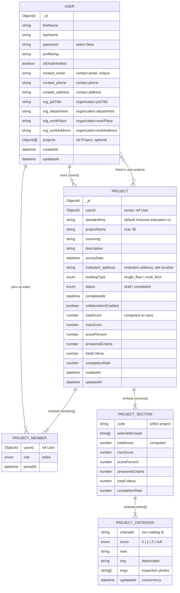

# ER Diagram — User & Project (MongoDB / Mongoose)

Logical entity-relationship view of `lib/model/user.ts` and `lib/model/project.ts`.  
In MongoDB, **ProjectSection**, **ProjectCriterion**, and **ProjectMember** are **embedded subdocuments** inside a `Project` document, not separate collections.

---

## Diagram (Mermaid)

Paste into GitHub, Notion, or [mermaid.live](https://mermaid.live) to export PNG/SVG for your report.

---

## Relationship summary

| Relationship | Cardinality | Implementation |
|--------------|-------------|----------------|
| User **owns** Project | 1 : N | `Project.userId` → `User._id` |
| User **references** Project | 1 : N (optional) | `User.projects[]` → `Project._id` |
| User **member of** Project | M : N | `Project.members[].userId` → `User._id`, role `editor` |
| Project **contains** Section | 1 : N | Embedded `sections[]` |
| Section **contains** Criterion | 1 : N | Embedded `sections[].criteria[]` |

---

## Related collections (optional appendix)

Not part of the core User/Project inspection model, but used by the app:

| Collection | Links to |
|------------|----------|
| `ProjectInvite` | `projectId` → Project, `createdBy` → User |
| `OTP` | `email` matches `User.contact.email` (no ObjectId link) |

---

## Notes for your report

1. **Owner vs editor:** The project **owner** is always `Project.userId`. **Editors** appear only in `members[]` when collaboration is enabled.
2. **Computed fields:** `totalScore`, `completionRate`, etc. are recalculated in a Mongoose `pre("save")` hook from criterion scores (0 / 1 / 2).
3. **Standards data:** Criterion definitions live in static JSON (`lib/standards/`); only scores and notes are stored in `ProjectCriterion`.
4. **Diagram style:** This is a **logical ER** view. Physically, MongoDB stores one `Project` document with nested arrays, not separate tables for sections or criteria.
