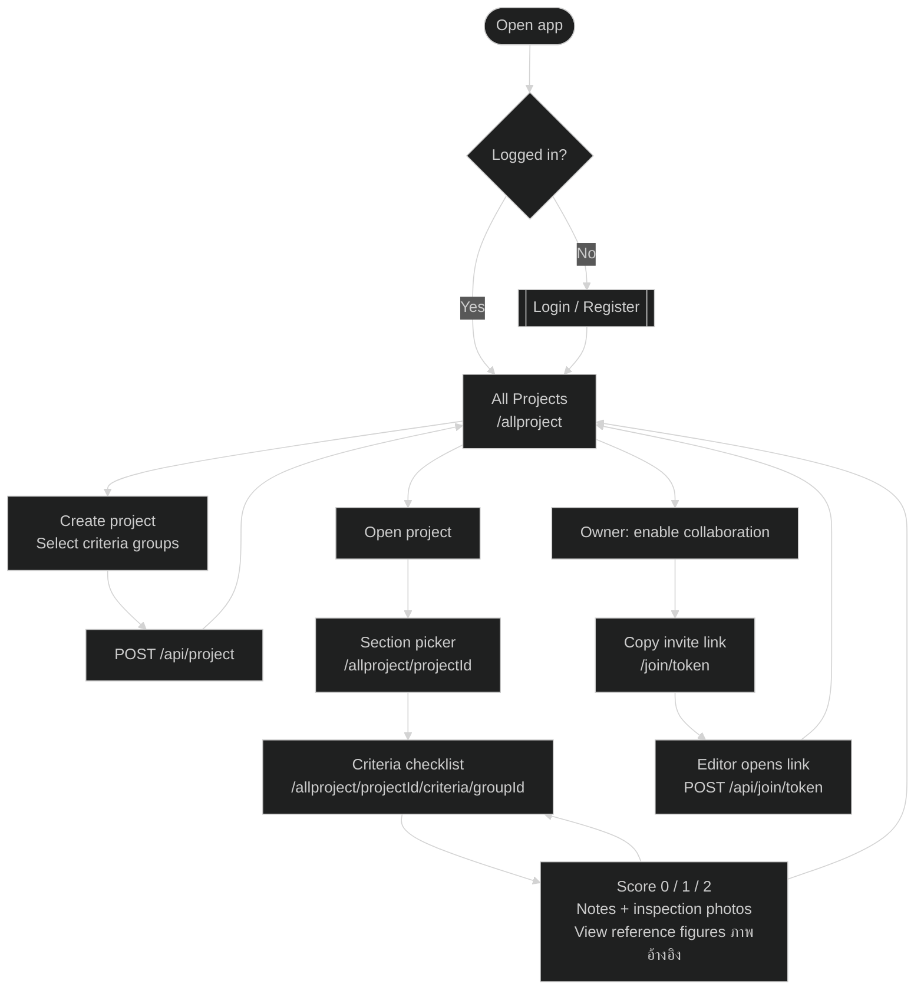
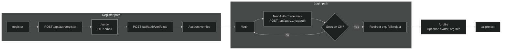
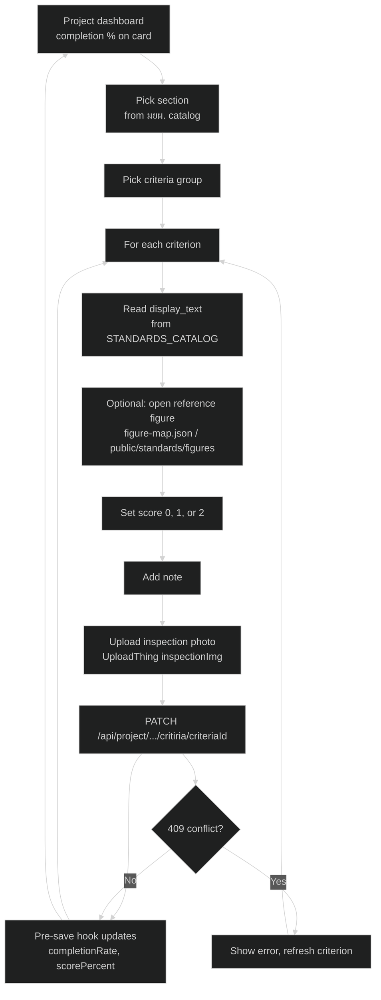
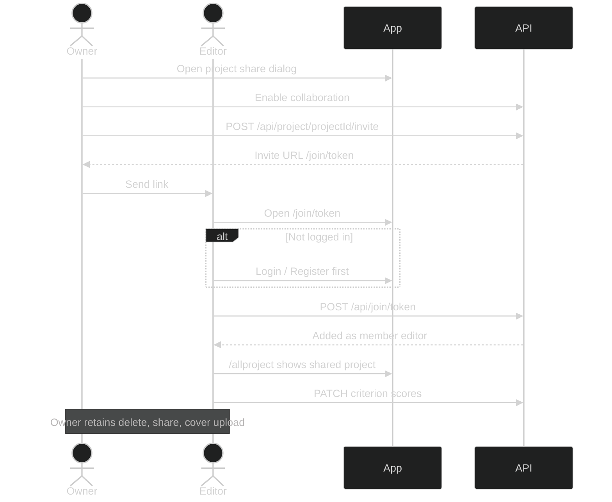

# User Flow Diagrams — Accessibility Inspection App

Based on the **Main User Flow** and feature slides in [`capstone-project-slides.html`](../presentation/capstone-project-slides.html) (Capstone presentation — มยผ. 6301).

Use [mermaid.live](https://mermaid.live) to export PNG/SVG for your report.

---

## 1. Main inspector flow (from presentation slide *Main User Flow*)

This matches the slide text:

> Login / Register → All Projects → Create project → Section picker → Criteria checklist → Score, notes, photos + reference image  
> Share: owner enables collaboration → copy `/join/[token]`



---

## 2. Authentication & onboarding flow

Derived from slides *What Inspectors Can Do*, *API Endpoints — Collaboration & Auth*, and app routes (`login/`, `register/`, `verify/`).



---

## 3. Inspection workflow (detail)

Expands the middle of the main flow using *Domain Model — Project* and *Standards Catalog* slides.



---

## 4. Collaboration flow (from *Share* slide + API table)



---

## 5. Route & API map (presentation reference)

| Step | UI route | API (from slides) |
|------|----------|-------------------|
| Register | `/register` | `POST /api/auth/register` |
| Verify email | `/verify` | `POST /api/auth/verify-otp`, resend |
| Login | `/login` | NextAuth `/api/auth/[...nextauth]` |
| Profile | `/profile` | `GET/PATCH /api/users/[id]` |
| Project list | `/allproject` | `GET /api/project` |
| Create project | modal on dashboard | `POST /api/project` |
| Project detail | `/allproject/[projectId]` | `GET /api/project/[projectId]` |
| Criteria | `/allproject/.../criteria/[groupId]` | `PATCH .../critiria/[critiriaId]` |
| Invite | share dialog | `POST .../invite`, `POST /api/join/[token]` |
| Uploads | in forms | `POST /api/uploadthing` |

---

## 6. Actors (for report caption)

| Actor | Can do (from slides + app) |
|-------|----------------------------|
| **Inspector (owner)** | Register, create projects, select criteria groups, score, upload photos, view reference figures, track completion %, share invites |
| **Editor (member)** | Join via `/join/[token]`, score criteria on shared project (limited permissions) |
| **System** | Load มยผ. 6301 from JSON catalog; recalculate completion on save; store data in MongoDB |

---

## Source slide reference

Primary flow text is on slide **"Main User Flow"** in `docs/presentation/capstone-project-slides.html`:

```
Login / Register → All Projects (/allproject)
↓ Create project (select criteria groups) → POST /api/project
↓ Section picker → Criteria checklist
↓ Score, notes, photos + reference image (ภาพอ้างอิง)
Share: owner enables collaboration → copy /join/[token]
```

Supporting slides: **What Inspectors Can Do**, **Domain Model — Project**, **Standards Catalog**, **API Endpoints — Projects**, **API Endpoints — Collaboration & Auth**, **UploadThing**.
