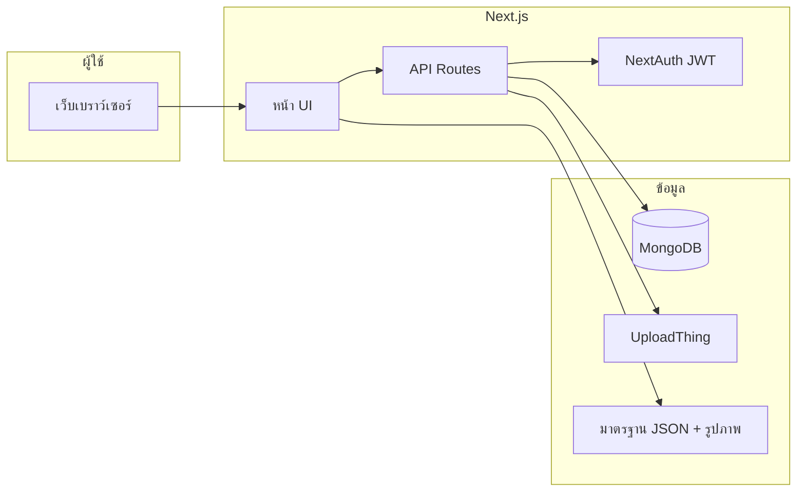

# โปรแกรมประยุกต์บนเว็บสำหรับการตรวจประเมินสิ่งอำนวยความสะดวกตามมาตรฐาน มยผ. 6301

**Web Application for Building Accessibility Inspection against Thai Standard MYPHO 6301**

---

**[ชื่อนักศึกษา 1]**, **[ชื่อนักศึกษา 2]**, **[ชื่อนักศึกษา 3]**, **[ชื่อนักศึกษา 4]**  
และ **[ตำแหน่ง] [ชื่ออาจารย์ที่ปรึกษา]**

**[Student Name 1]**, **[Student Name 2]**, **[Student Name 3]**, **[Student Name 4]**  
and **[Advisor Title] [Advisor Name]**

**ภาควิชา** [ระบุภาควิชา]  
**มหาวิทยาลัย** [ระบุมหาวิทยาลัย]  
**ปีการศึกษา** [2568 / 2569]

---

## บทคัดย่อ

โครงงานนี้พัฒนาโปรแกรมประยุกต์บนเว็บไซต์สำหรับการตรวจประเมินสิ่งอำนวยความสะดวกของอาคารและสถานที่ตามมาตรฐาน **มยผ. 6301** (การออกแบบสิ่งอำนวยความสะดวกสำหรับคนพิการและผู้สูงอายุในสาธารณะ) ซึ่งเป็นแนวทางที่หน่วยงานภาครัฐและผู้รับผิดชอบอาคารสาธารณะนำมาใช้ในการตรวจสอบความเป็นไปตามข้อกำหนด ปัจจุบันการตรวจประเมินมักเก็บข้อมูลในรูปแบบกระดาษหรือสเปรดชีต ทำให้การติดตามความคืบหน้า การบันทึกหลักฐานภาพ และการทำงานร่วมกันของทีมตรวจมีความยุ่งยากและเสี่ยงต่อข้อมูลไม่สอดคล้องกัน

โครงงานจึงพัฒนาระบบเว็บแอปพลิเคชันแบบ **Mobile-first** ที่ผู้ใช้สามารถลงทะเบียนและเข้าสู่ระบบ สร้างโครงการตรวจ (โครงการ/อาคาร) เลือกกลุ่มเกณฑ์จากมาตรฐาน ให้คะแนนแต่ละข้อ (0 / 1 / 2) บันทึกหมายเหตุ อัปโหลดรูปภาพการตรวจ และดู **ภาพอ้างอิง** จากเอกสารมาตรฐาน (แผนภาพที่สกัดจาก PDF อย่างเป็นทางการ) ระบบคำนวณอัตราความสำเร็จของโครงการอัตโนมัติ รองรับการค้นหาโครงการ การแชร์โครงการให้เพื่อนร่วมทีมเข้าร่วมตรวจผ่านลิงก์เชิญ และการจัดการรูปโปรไฟล์/ปกโครงการผ่านบริการอัปโหลดไฟล์

ระบบพัฒนาด้วย **Next.js 16** (App Router), **React 19**, **NextAuth** (JWT), **MongoDB** (Mongoose), **UploadThing** และเนื้อหามาตรฐานในรูปแบบ JSON ร่วมกับรูปภาพอ้างอิงใน `public/standards/figures/` โดยมีบริการ ML แยก (Python/Flask) สำหรับประเมินความเสี่ยงอาคารที่สามารถขยายเชื่อมต่อในอนาคต แต่ยังไม่ได้ผูกเข้ากับขั้นตอนตรวจหลักของแอปพลิเคชัน

**คำสำคัญ:** โปรแกรมประยุกต์บนเว็บไซต์, มยผ. 6301, การตรวจสอบสิ่งอำนวยความสะดวก, Next.js, MongoDB

---

## Abstract

This capstone project develops a **web application** for building **accessibility inspections** against the Thai public-sector standard **MYPHO 6301** (inclusive design for persons with disabilities and older adults). Inspectors often rely on paper forms or spreadsheets, which makes progress tracking, photo evidence, and team collaboration difficult and inconsistent.

The system is a **mobile-first** web app where authenticated users create inspection **projects**, select criteria groups from the standard catalog, score each criterion (0 / 1 / 2), add notes, upload inspection photos, and view **reference figures** extracted from the official standard PDF. Projects show automatic **completion rates**, support **search**, **collaboration invites** for co-inspectors, and file uploads for profile and project cover images.

The stack includes **Next.js 16**, **React 19**, **NextAuth (JWT)**, **MongoDB (Mongoose)**, **UploadThing**, and static standard data in JSON plus figure assets. A separate **Python ML service** (Flask) provides optional building risk prediction for future integration; it is not yet wired into the main inspection user flow.

**Keywords:** Web application, MYPHO 6301, accessibility inspection, Next.js, MongoDB

---

## สารบัญ

1. บทนำ  
2. งานวิจัยและเทคโนโลยีที่เกี่ยวข้อง  
3. วิธีดำเนินโครงงาน  
4. ผลการดำเนินงาน  
5. สรุปผลการดำเนินงานและข้อเสนอแนะ  
6. กิตติกรรมประกาศ  
7. เอกสารอ้างอิง  
8. ภาคผนวก  

---

## 1. บทนำ

### 1.1 ที่มาและความสำคัญ

การออกแบบและตรวจสอบสิ่งอำนวยความสะดวกในอาคารสาธารณะเป็นส่วนสำคัญในการให้บุคคลทุกกลุ่มเข้าถึงพื้นที่ได้อย่างเท่าเทียม โดยเฉพาะผู้มีความบกพร่องทางร่างกาย ผู้สูงอายุ และผู้ใช้รถเข็น มาตรฐาน **มยผ. 6301** กำหนดเกณฑ์และแนวทางปฏิบัติที่หน่วยงานรัฐและผู้รับผิดชอบอาคารต้องอ้างอิง การตรวจประเมินจริงมักมีจำนวนเกณฑ์มาก แบ่งเป็นหมวด เช่น ทางเข้า–ทางเดิน ประตู–หน้าต่าง ที่จอดรถ ป้ายสัญลักษณ์ และสิ่งอำนวยความสะดวกทั่วไป ทำให้การบันทึกด้วยกระดาษหรือไฟล์แยกกันสะดวกในการพกพาแต่ยากต่อการสรุปผล เปรียบเทียบระหว่างโครงการ และทำงานพร้อมกันหลายคน

นอกจากนี้ ผู้ตรวจต้องอ้างอิงแผนภาพและข้อความในเอกสารมาตรฐานขณะอยู่หน้างาน หากไม่มีเครื่องมือดิจิทัลที่รวมเกณฑ์ ภาพอ้างอิง คะแนน หมายเหตุ และรูปถ่ายหลักฐานไว้ที่เดียว จะเพิ่มเวลาและความผิดพลาดในการบันทึก โครงงานนี้จึงมุ่งพัฒนาเว็บแอปพลิเคชันที่ช่วยให้การตรวจประเมินทำได้บนมือถือหรือแท็บเล็ต สรุปความคืบหน้าเป็นเปอร์เซ็นต์ และรองรับการทำงานร่วมกันในทีมตรวจ

### 1.2 วัตถุประสงค์

1. เพื่อพัฒนาโปรแกรมประยุกต์บนเว็บสำหรับบันทึกการตรวจประเมินตามมาตรฐาน มยผ. 6301 อย่างเป็นระบบ  
2. เพื่อให้ผู้ใช้สามารถสร้างโครงการตรวจ เลือกกลุ่มเกณฑ์ ให้คะแนน บันทึกหมายเหตุ และแนบรูปภาพหลักฐานได้สะดวก  
3. เพื่อแสดงภาพอ้างอิงจากเอกสารมาตรฐานควบคู่กับแต่ละเกณฑ์ เพื่อลดการค้นหาในเอกสาร PDF ขณะปฏิบัติงาน  
4. เพื่อคำนวณอัตราความสำเร็จของโครงการอัตโนมัติ และรองรับการค้นหาโครงการและการทำงานร่วมกันผ่านลิงก์เชิญ  
5. เพื่อศึกษาและเตรียมโครงสร้างเชื่อมต่อบริการ Machine Learning สำหรับการประเมินความเสี่ยงอาคารในอนาคต (ส่วนขยาย)

### 1.3 ทฤษฎีและวรรณกรรมที่เกี่ยวข้อง

#### 1.3.1 มาตรฐานการออกแบบสิ่งอำนวยความสะดวก (มยผ. 6301)

มยผ. 6301 เป็นแนวทางด้านการออกแบบสิ่งอำนวยความสะดวกสำหรับคนพิการและผู้สูงอายุในสาธารณะ ครอบคลุมหลายด้านของอาคารและพื้นที่ การนำมาใช้ในระบบดิจิทัลต้องแปลงโครงสร้างเกณฑ์เป็นข้อมูลที่เครื่องอ่านได้ (เช่น รหัสข้อ `item_id` ข้อความแสดงผล หมายเหตุ และการเชื่อมโยงไปยังภาพอ้างอิง) เพื่อให้ผู้ตรวจเลือกและให้คะแนนได้ตรงกับมาตรฐาน

#### 1.3.2 โปรแกรมประยุกต์บนเว็บ (Web Application)

เว็บแอปพลิเคชันเข้าถึงผ่านเบราว์เซอร์โดยไม่ต้องติดตั้ง แบ่งเป็น **ฝั่งผู้ใช้ (Front-End)** สำหรับแสดงผลและรับข้อมูล และ **ฝั่งเซิร์ฟเวอร์ (Back-End)** สำหรับยืนยันตัวตน จัดเก็บข้อมูล และ API การทำงานกับฐานข้อมูล โครงงานนี้ใช้ **Next.js** รวม Front-End และ API Routes ในโปรเจกต์เดียว ลดความซับซ้อนในการ deploy

#### 1.3.3 เทคโนโลยีที่นำมาใช้

| เทคโนโลยี | บทบาทในโครงงาน |
|-----------|----------------|
| **Next.js 16** | เฟรมเวิร์ก React, App Router, API Routes |
| **React 19** | ส่วนติดต่อผู้ใช้แบบคอมโพเนนต์ |
| **NextAuth (Auth.js)** | เข้าสู่ระบบด้วยอีเมล/รหัสผ่าน, เซสชัน JWT |
| **MongoDB + Mongoose** | เก็บผู้ใช้ โครงการ เกณฑ์ คะแนน รูปภาพ |
| **UploadThing** | อัปโหลดรูปโปรไฟล์ รูปตรวจ ปกโครงการ |
| **bcryptjs** | เข้ารหัสรหัสผ่าน |
| **CSS Modules** | จัดรูปแบบ UI แบบ mobile shell |
| **Python + PyMuPDF** | สกัดภาพอ้างอิงจาก PDF มาตรฐาน (ขั้นตอนพัฒนา) |
| **Flask (ml-service)** | API ประเมินความเสี่ยงอาคาร (ทดลอง/ขยายอนาคต) |

#### 1.3.4 วรรณกรรมที่เกี่ยวข้อง (สรุปแนวคิด)

- การออกแบบ **Universal Design** เน้นการเข้าถึงสำหรับผู้ใช้หลากหลายกลุ่ม  
- การใช้ **ฐานข้อมูลเอกสาร (Document-oriented)** อย่าง MongoDB เหมาะกับโครงสร้างโครงการที่มี sections และ criteria ซ้อนกัน  
- การทำงานร่วมกันหลายผู้ใช้ต้องมีกลไก **ยืนยันตัวตน** และ **สิทธิ์เจ้าของโครงการ/สมาชิก** เพื่อความถูกต้องของข้อมูล  

*(ผู้จัดทำควรเพิ่มอ้างอิงวิชาการ/ราชการตามที่อาจารย์ที่ปรึกษากำหนด)*

### 1.4 ขอบเขตของโครงงาน

1. เว็บแอปพลิเคชันสำหรับผู้ตรวจที่ลงทะเบียนและเข้าสู่ระบบแล้ว  
2. เนื้อหาเกณฑ์อ้างอิงมาตรฐาน มยผ. 6301 ในรูปแบบ JSON และภาพอ้างอิงที่สกัดจาก PDF ต้นฉบับ (8 หมวดหลักใน catalog)  
3. การให้คะแนนระดับ 0 / 1 / 2 ต่อเกณฑ์ บันทึกหมายเหตุ และรูปภาพการตรวจ  
4. การแชร์โครงการให้ผู้ร่วมตรวจ (บทบาท editor) ผ่านลิงก์เชิญ  
5. **นอกขอบเขตหลัก:** แอปมือถือ native, การออกรายงาน PDF อัตโนมัติครบทุกข้อ, การผูก ML เข้าหน้าตรวจหลัก (มีเพียงบริการทดลองแยก)

### 1.5 ประโยชน์ที่คาดว่าจะได้รับ

1. ผู้ตรวจลดเวลาในการค้นหาเกณฑ์และภาพอ้างอิงจากเอกสารกระดาษ/PDF  
2. หน่วยงานหรือทีมงานเห็นความคืบหน้าของโครงการตรวจเป็นเปอร์เซ็นต์แบบเรียลไทม์หลังบันทึก  
3. ข้อมูลคะแนน หมายเหตุ และรูปถ่ายอยู่ในฐานข้อมูลเดียว สะดวกต่อการสืบค้นและทำงานร่วมกัน  
4. เป็นแนวทางพัฒนาต่อยอดด้านรายงานสรุปผลและการประเมินความเสี่ยงด้วย ML  

### กลุ่มเป้าหมาย

- นักศึกษา บุคลากร หรือผู้ปฏิบัติงานที่ต้องตรวจประเมินสิ่งอำนวยความสะดวกตาม มยผ. 6301  
- ทีมตรวจที่ต้องการแบ่งหน้าที่ตรวจคนละหมวดและรวมผลในโครงการเดียว  

---

## 2. งานวิจัยและเทคโนโลยีที่เกี่ยวข้อง

### 2.1 สถาปัตยกรรมระบบ

ระบบแบ่งเป็น 3 ชั้นหลัก:

1. **ชั้นนำเสนอ (Presentation):** หน้า Login, Register, แดชบอร์ดโครงการ, รายการหมวด, รายการเกณฑ์, โปรไฟล์ — ใช้ React Client Components และ CSS Modules  
2. **ชั้นบริการ (Application / API):** Next.js API Routes — จัดการโครงการ, เกณฑ์, ผู้ใช้, การเชิญร่วมงาน, UploadThing  
3. **ชั้นข้อมูล (Data):** MongoDB เก็บ User, Project (sections, criteria, scores, images)  



### 2.2 โมเดลข้อมูลหลัก

**ผู้ใช้ (User):** ชื่อ, นามสกุล, อีเมล (ใช้ login), รหัสผ่านเข้ารหัส, รูปโปรไฟล์, องค์กร (ถ้ามี)

**โครงการ (Project):**  
- เจ้าของ (`userId`), ชื่อโครงการ, คำอธิบาย, ที่อยู่สถานที่  
- `sections[]` แต่ละหมวดมี `criteria[]`  
- แต่ละเกณฑ์: `criteriaId`, `score` (0|1|2|null), `note`, `imgs[]`, `updatedAt`  
- `completionRate` คำนวณก่อนบันทึก (Mongoose pre-save)  
- `collaborationEnabled`, `members[]` (editor), ลิงก์เชิญ (`ProjectInvite`)

### 2.3 การทำงานร่วมกันและความปลอดภัย

- Middleware ตรวจ JWT สำหรับหน้าและ API ที่ไม่ใช่ public (`/login`, `/register`, `/join/*`, auth, uploadthing callback)  
- การแก้ไขเกณฑ์รองรับ `expectedUpdatedAt` — หากมีผู้แก้ก่อน คืน **HTTP 409** แจ้งให้รีเฟรช  
- เจ้าของโครงการเท่านั้นที่อัปโหลดปกและเปิด/ปิดการแชร์; สมาชิก editor ตรวจและให้คะแนนได้  

---

## 3. วิธีดำเนินโครงงาน

### 3.1 การศึกษาความต้องการและมาตรฐาน

1. ศึกษาเอกสาร มยผ. 6301 (`standards-source/maypho6301.pdf`)  
2. จัดทำข้อมูลเกณฑ์เป็น JSON 8 ไฟล์ใน `lib/standards/`  
3. สกัดภาพอ้างอิงด้วย `scripts/extract-pdf-figures.py` → `public/standards/figures/` และ `figure-map.json`  

### 3.2 เครื่องมือในการพัฒนา

| หมวด | เครื่องมือ |
|------|-----------|
| แก้ไขโค้ด | Visual Studio Code / Cursor |
| ควบคุมเวอร์ชัน | Git, GitHub |
| ออกแบบ UI (ถ้ามี) | Figma หรือออกแบบใน CSS โดยตรง |
| รันระบบ | Node.js, `npm run dev` (พอร์ต 3000) |
| ฐานข้อมูล | MongoDB Atlas หรือ local |
| ทดสอบ | `npm test`, `npm run validate` |

### 3.3 การออกแบบส่วนติดต่อผู้ใช้

ใช้รูปแบบ **PhoneShell** — ความกว้างสูงสุดประมาณ 420px พื้นหลังไล่สีโทนเขียว-เทา จำลองการใช้งานบนมือถือ หน้าหลักประกอบด้วย:

- วงแหวนแสดง % ความสำเร็จรวมของโครงการทั้งหมด  
- ช่องค้นหาโครงการ (ชื่อ + ที่อยู่)  
- กริดการ์ดโครงการ (รูปปก, ชื่อ, จำนวน checkpoint, % Done)  
- สถานะว่าง: ปุ่ม Start Project กึ่งกลาง  

### 3.4 ขั้นตอนการพัฒนาระบบ

| ลำดับ | งาน | รายละเอียด |
|------|-----|------------|
| 1 | ระบบสมาชิก | ลงทะเบียน, OTP อีเมล (ถ้าเปิดใช้), Login ด้วย Credentials, โปรไฟล์ |
| 2 | โครงการ | สร้าง/ลบ/แก้ไข, เลือกกลุ่มเกณฑ์, ค้นหา |
| 3 | การตรวจ | หน้าหมวด → หน้ากลุ่มเกณฑ์ → ให้คะแนน, หมายเหตุ, รูป, ภาพอ้างอิง |
| 4 | ไฟล์ | UploadThing: profileImg, inspectionImg, projectCoverImg |
| 5 | ทำงานร่วมกัน | เปิด collaboration, ลิงก์ `/join/[token]`, บทบาท editor |
| 6 | คุณภาพโค้ด | Unit tests, validate-premerge, API middleware |

### 3.5 การทดสอบ

- ทดสอบการใช้งานด้วยตนเองตาม flow: สมัคร → สร้างโครงการ → ให้คะแนน → อัปโหลดรูป → แชร์โครงการ  
- รันชุดทดสอบอัตโนมัติ 13 test cases (project patch, concurrency 409, access control)  
- รัน validate 40 รายการก่อน merge  

---

## 4. ผลการดำเนินงาน

### 4.1 ผลการพัฒนาโครงงาน

ระบบที่พัฒนาได้มีฟังก์ชันหลักดังนี้:

| ลำดับ | ฟังก์ชัน | คำอธิบาย |
|------|---------|----------|
| 1 | ลงทะเบียน / เข้าสู่ระบบ | สร้างบัญชีด้วยอีเมล รหัสผ่านเข้ารหัส JWT session |
| 2 | แดชบอร์ดโครงการ | แสดงรายการโครงการ % สำเร็จ ค้นหา สร้างโครงการใหม่ |
| 3 | สร้างโครงการ | เลือกกลุ่มเกณฑ์จากมาตรฐาน ระบุชื่อ สถานที่ |
| 4 | ตรวจเกณฑ์ | คะแนน 0/1/2 หมายเหตุ รูปตรวจ ภาพอ้างอิง มยผ. |
| 5 | โปรไฟล์ | แก้ไขข้อมูล อัปโหลดรูปโปรไฟล์ |
| 6 | แชร์โครงการ | ลิงก์เชิญ 7 วัน สมาชิก editor |
| 7 | การ์ดโครงการ | ปกโครงการ เมนูแชร์/ลบ (เจ้าของ) |

**หมายเหตุ:** ให้แทรกภาพหน้าจอจริงของระบบในตำแหน่ง “รูปที่ 1–7” ก่อนส่งรายงานฉบับสมบูรณ์

- **รูปที่ 1** หน้าเข้าสู่ระบบ (Login)  
- **รูปที่ 2** หน้าลงทะเบียน (Register)  
- **รูปที่ 3** แดชบอร์ด My Project พร้อมการ์ดโครงการ  
- **รูปที่ 4** หน้าสร้างโครงการ (เลือกกลุ่มเกณฑ์)  
- **รูปที่ 5** หน้ารายการหมวดของโครงการ  
- **รูปที่ 6** หน้ารายการเกณฑ์ พร้อมคะแนน หมายเหตุ และภาพอ้างอิง  
- **รูปที่ 7** โมดัลแชร์โครงการ / หน้า Join ด้วยลิงก์เชิญ  

### 4.2 ช่องทางการเข้าถึงผลลัพธ์ของโครงงาน

- **ที่เก็บซอร์สโค้ด:** [ระบุ URL GitHub ของทีม]  
- **เอกสารสำหรับนักพัฒนา:** `docs/AI_PROJECT_GUIDE.md`  
- **รันระบบทดสอบ:** `npm run dev` แล้วเปิด `http://localhost:3000`  

### 4.3 เกณฑ์การประเมินผล (แบบฟอร์มความพึงพอใจ)

ทีมสามารถใช้ Google Form ประเมินความพึงพอใจตามตารางด้านล่าง (ปรับข้อความให้ตรงกับระบบตรวจ มยผ.) เกณฑ์คะแนนเฉลี่ยอ้างอิงลิเคิร์ตสเกล 5 ระดับ เช่นเดียวกับตัวอย่างรายงานโครงงาน

**ตารางที่ 1 ตัวอย่างข้อคำถามประเมินเว็บแอป (14 ข้อ)**  
ความสวยงาม, การจัดรูปแบบ, สีสัน, ความง่ายของเมนู, ความอ่านง่าย, ภาพกับเนื้อหา, ความเป็นประโยชน์ของเนื้อหา, ความเพียงพอของข้อมูล, ความสะดวกในการใช้งาน, การเชื่อมโยงภายใน, ความเร็วในการโหลด ฯลฯ

**ตารางที่ 2 ตัวอย่างข้อคำถามประเมินการตรวจเกณฑ์ (6 ข้อ)**  
ความถูกต้องของเกณฑ์, ความสะดวกในการให้คะแนน, ภาพอ้างอิงช่วยทำความเข้าใจ, การอัปโหลดรูป, การทำงานร่วมกัน, ความรวดเร็วในการบันทึก

**ตารางที่ 3–4** กรอกค่าเฉลี่ยและความหมายหลังสำรวจกลุ่มทดสอบ (เช่น นักศึกษา 15–30 คน)

| ระดับคะแนนเฉลี่ย | ความหมาย |
|------------------|----------|
| 4.51 – 5.00 | มากที่สุด |
| 3.51 – 4.50 | มาก |
| 2.51 – 3.50 | ปานกลาง |
| 1.51 – 2.50 | น้อย |
| 1.00 – 1.50 | น้อยที่สุด |

---

## 5. สรุปผลการดำเนินงานและข้อเสนอแนะ

### 5.1 สรุป

โครงงานพัฒนาเว็บแอปพลิเคชันสำหรับการตรวจประเมินสิ่งอำนวยความสะดวกตาม มยผ. 6301 สำเร็จตามขอบเขตหลัก ผู้ใช้สามารถจัดการโครงการตรวจ บันทึกคะแนนและหลักฐาน ดูภาพอ้างอิงจากมาตรฐาน และทำงานร่วมกันผ่านลิงก์เชิญได้ ระบบใช้สแตก Next.js, MongoDB และ UploadThing อย่างสอดคล้องกับแนวทางพัฒนาเว็บสมัยใหม่

### 5.2 ข้อจำกัด

- ยังไม่มีรายงาน PDF/Word ส่งออกอัตโนมัติครบทุกเกณฑ์  
- ML risk prediction อยู่ในบริการแยก ยังไม่ผูกกับ UI ตรวจหลัก  
- ไม่มีการซิงค์แบบ real-time ระหว่างผู้ตรวจหลายคนบนเกณฑ์เดียวกัน (ใช้ last-write + 409 เมื่อชนกัน)  

### 5.3 ข้อเสนอแนะการพัฒนาต่อ

1. ส่งออกรายงานสรุปผลตรวจเป็น PDF/Excel ตามรูปแบบหน่วยงาน  
2. ผูก ML service เข้าหน้าสรุปโครงการหรือรายการเตือนความเสี่ยง  
3. แจ้งเตือนเมื่อมีสมาชิกแก้เกณฑ์หรือใกล้ครบ 100%  
4. แอป PWA หรือ native สำหรับใช้งานออฟไลน์ชั่วคราว  

---

## 6. กิตติกรรมประกาศ

โครงงานนี้สำเร็จลุล่วงไปได้ด้วยดีด้วยความกรุณาจาก **[ชื่ออาจารย์ที่ปรึกษา]** ที่ให้คำแนะนำและแนวทางแก้ไข ทางคณะผู้จัดทำขอขอบพระคุณเป็นอย่างสูง

ขอขอบคุณอาจารย์ในคณะ **[ระบุคณะ/ภาควิชา]** ผู้ให้คำปรึกษา และเพื่อนนักศึกษาที่ช่วยทดลองใช้งานและให้ข้อเสนอแนะ

---

## 7. เอกสารอ้างอิง

[1] Vercel, "Next.js Documentation," [ออนไลน์]. สืบค้น: https://nextjs.org/docs  
[2] Meta, "React Documentation," [ออนไลน์]. สืบค้น: https://react.dev  
[3] Auth.js, "NextAuth.js Documentation," [ออนไลน์]. สืบค้น: https://authjs.dev  
[4] MongoDB, Inc., "MongoDB Documentation," [ออนไลน์]. สืบค้น: https://www.mongodb.com/docs  
[5] Mongoose, "Mongoose Documentation," [ออนไลน์]. สืบค้น: https://mongoosejs.com  
[6] UploadThing, "UploadThing Docs," [ออนไลน์]. สืบค้น: https://docs.uploadthing.com  
[7] กรมควบคุมอาคาร ฯลฯ, "มาตรฐาน มยผ. 6301," [ระบุแหล่งเอกสารราชการ/ PDF ที่ทีมใช้]  
[8] Tailwind Labs, "Tailwind CSS," [ออนไลน์]. สืบค้น: https://tailwindcss.com/ *(ถ้าใช้ในอนาคต)*  
[9] โครงการ Capstone-Project, "docs/AI_PROJECT_GUIDE.md," เอกสารภายใน repository  

---

## 8. ภาคผนวก

### ภาคผนวก ก รายชื่อไฟล์มาตรฐาน (JSON)

1. `ทั่วไป.json`  
2. `ทางเข้าอาคาร ทางเดินระหว่างอาคาร ทางเชื่อมระหว่างอาคาร ทางลาด ลิฟต์ และบันได.json`  
3. `ประตูและหน้าต่าง.json`  
4. `ที่จอดรถและที่รับส่งผู้โดยสาร.json`  
5. `ที่พักอาศัยและห้องนอน.json`  
6. `การครอบครองพิเศษ.json`  
7. `ป้ายสัญลักษณ์.json`  
8. `อย่ายุ่งกับอันนี้.json` (สิ่งอำนวยความสะดวก / สาธารณูปโภค)

### ภาคผนวก ข คำสั่งรันระบบ

```bash
npm install
npm run dev          # http://localhost:3000
npm test             # unit tests
npm run validate     # pre-merge checks
```

### ภาคผนวก ค ตัวแปรสภาพแวดล้อม (.env)

- `MONGO_URI` — เชื่อมต่อ MongoDB  
- `AUTH_SECRET` — คีย์ NextAuth  
- `UPLOADTHING_TOKEN` — อัปโหลดไฟล์  
- `EMAIL_USER` / `EMAIL_PASS` — ส่ง OTP (ถ้าเปิดใช้)

---

*จัดทำจากซอร์สโค้ดโครงงาน Capstone-Project — แก้ไขชื่อทีม อาจารย์ที่ปรึกษา มหาวิทยาลัย และแทรกภาพหน้าจอก่อนส่งรายงานฉบับจริง*
